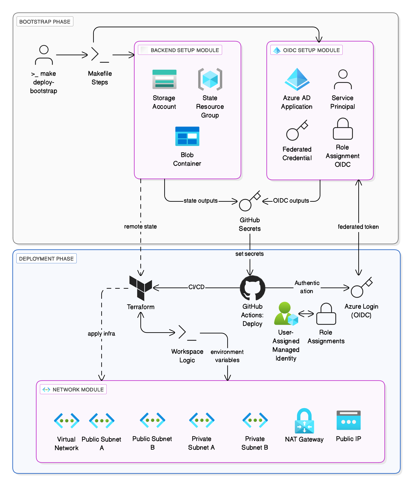

# Terraform Deployment to Azure — CI/CD Bootstrap Automation

This repository demonstrates an automated and reusable way to **bootstrap** your Azure infrastructure for Terraform-based deployments using **GitHub Actions and OIDC authentication**. It includes everything needed to set up:

- A **remote backend** (Storage Account, Blob container, Resource Group) for Terraform state.
- An **OIDC trust chain** between Azure AD and GitHub to allow secure pipeline authentication without manual secret management.
- A **network module** for validating deployments using multi-environment workspaces (e.g., `staging` and `production`).

> This repo is not a full infrastructure project. It's a **template or tip** to automate the foundational setup that is often manually configured (e.g., getting subscription ID, tenant ID, client ID, etc.).

---

## Architecture Overview



This flow automates:
- **Bootstrap Phase**: Using `make deploy-bootstrap`, it provisions:
  - Terraform state backend (Storage Account, Container, Resource Group).
  - Azure AD Application + Service Principal + Federated Identity Credential.
  - Role Assignment for GitHub OIDC trust.

- **Deployment Phase**:
  - Uses GitHub Actions to authenticate via OIDC.
  - Supports `staging`, `production`, or `both` workspaces.
  - Deploys a basic VNet module (with public/private subnets) to validate the pipeline.

---

## Repository Structure

```bash
.
├── bootstrap/
│   ├── backend_setup/       # Module to set up remote backend
│   ├── oidc/                # Module to configure OIDC trust
│   └── outputs/             # Generated files & backend secrets
├── modules/
│   └── network/             # Basic VNet with subnets (for testing)
├── scripts/
│   ├── generate_backend_provider.sh
│   └── generate_provider_file.sh
├── .github/workflows/
│   └── main.yml             # GitHub Actions workflow
├── main.tf / variables.tf / outputs.tf / providers.tf
├── Makefile                 # Bootstrap automation
└── README.md
```

---

## Getting Started

### 1. Bootstrap the Azure Backend + OIDC

Make sure you're logged into Azure CLI, then run:

```bash
make deploy-bootstrap
```

This command will:

- Save your Azure `subscription_id`, `tenant_id`.
- Create remote backend resources and OIDC trust.
- Generate and store provider files.
- Push GitHub secrets securely using `gh secret set`.

> You must have the [GitHub CLI](https://cli.github.com/) installed and authenticated.

### 2. Deploy Infrastructure via GitHub Actions

You can trigger the pipeline manually via the **Actions tab** or API:

```yaml
on:
  workflow_dispatch:
    inputs:
      environment:  # Choose from 'staging', 'production', or 'both'
      destroy:      # Optional: 'true' to destroy the environment
```

Or manually trigger using `gh` CLI:

```bash
gh workflow run main.yml -f environment=staging -f destroy=false
```

---

## Example Use Case

A sample `network` module is included to validate that:

- Terraform can access the remote backend.
- GitHub Actions can authenticate with Azure via OIDC.
- Environment-specific resources (VNet, subnets) can be deployed using workspaces.

---

## Environment Configurations

Defined in `variables.tf` as:

```hcl
network = {
  staging = {
    vnet_cidr = "10.0.0.0/16"
    ...
  }
  production = {
    vnet_cidr = "10.1.0.0/16"
    ...
  }
}
```

---

## Cleanup

To destroy all bootstrapped infrastructure:

```bash
make delete-bootstrap
```

This will:
- Destroy all resources created during bootstrap.
- Remove all local secrets and temporary files.

---

## Security Notes

- Uses GitHub OIDC with short-lived tokens.
- Avoids hardcoded secrets in provider files.
- Uses `gh secret` to manage credentials securely.

---

## Requirements

- Terraform ≥ 1.3.0
- Azure CLI
- GitHub CLI (`gh`)
- Permissions to create Azure AD apps and assign roles

---

## Acknowledgment

This repo serves as a clean pattern to avoid hardcoding Azure credentials and secret values, and to encourage automated, repeatable DevOps practices using GitHub Actions and native Azure support for OIDC.

---

## Author

**Fekri Saleh**  
Email: fekri.saleh@ucalgary.ca  
[LinkedIn](https://linkedin.com/in/your-profile) | [GitHub](https://github.com/fekri600)
